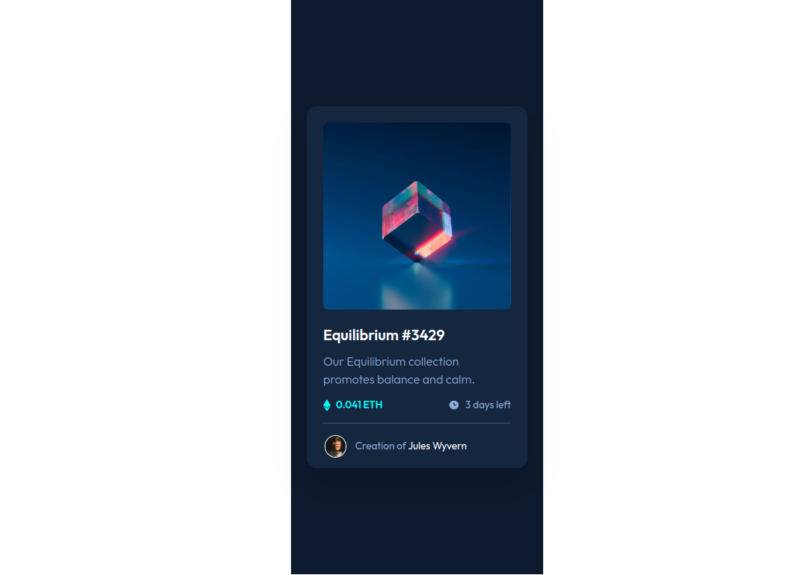
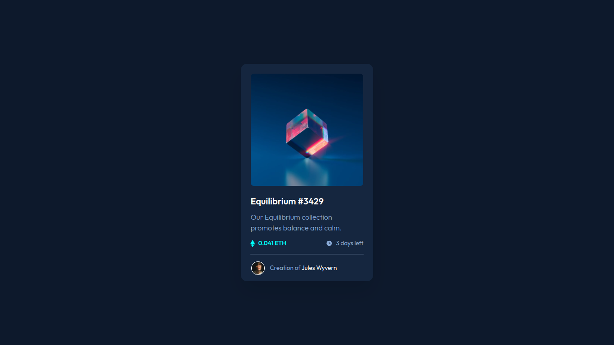

# Frontend Mentor - NFT preview card component solution

This is a solution to the [NFT preview card component challenge on Frontend Mentor](https://www.frontendmentor.io/challenges/nft-preview-card-component-SbdUL_w0U). Frontend Mentor challenges help you improve your coding skills by building realistic projects. 

## Table of contents

- [Screenshot](#screenshot)
- [Links](#links)
- [My process](#my-process)
- [Built with](#built-with)
- [Author](#author)
- [Acknowledgments](#acknowledgments)

### Screenshot

### Links

- [Github](https://github.com/Have-Samuel/nft-preview-card)
- [Live Link](https://cool-nft-card-preview.netlify.app/)

## My process

### Built with

- Semantic HTML5 markup
- CSS custom properties
- Flexbox
- CSS Grid
- Mobile-first workflow
- Flexbox
- Positioning

## Author
- [Github](https://github.com/Have-Samuel)
- [@Have-Samuel](https://www.frontendmentor.io/profile/Have-Samuel)
- [@samhave1](https://twitter.com/samhave1)
- [LinkedIn](https://www.linkedin.com/in/have-samuel/)

## 🤝 Contributing

Contributions, issues, and feature requests are welcome!

Feel free to check the [issues page](https://github.com/Have-Samuel/nft-preview-card/issues).

## Show your support

Give a ⭐️ if you like this project!

## Acknowledgments

- Thanks to Frontend Mentor
- etc

## 📝 License

This project is [MIT](./MIT.md) licensed.